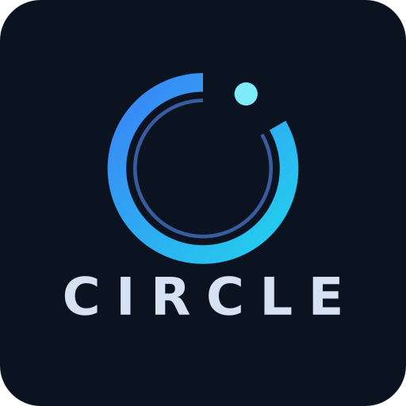

# Circle — 单 Agent 多任务协作系统

<p align="center">
  
</p>

> 由**单个 Agent 主动管理多任务**，使用者在微信中只面对一个「Coordinator」，
> 系统内部通过 **Coordinator / Worker / Scheduler** 组成的 Agent Team 完成
> 任务沟通、执行与周期调度的分工协作，无需在多个 Agent 之间切换上下文。

## 角色分工

```
                    ┌────────────────────────────────────────┐
   使用者 (微信) ──► │              Coordinator               │  ← 唯一对话入口，仅沟通
                    │  · 响应用户对话 / 汇报结果               │
                    │  · 安全评估（拒绝破坏性与敏感请求）        │
                    └───────┬────────────────────┬───────────┘
                            │ dispatch_task      │ create_schedule
                            ▼                    ▼
                 ┌──────────────────┐   ┌──────────────────┐
                 │ Worker × N       │   │ Scheduler        │  ← 管理定时任务
                 │ · 独立工作环境     │   │ · 增删改定时任务   │
                 │ · 执行具体任务     │   │ · 触发并跟进      │
                 │ · 产出物输出到工作区│   │ · 每日清理(30天)  │
                 └──────────────────┘   └──────────────────┘
```

| 角色 | 职责 | 边界 |
| --- | --- | --- |
| **Coordinator** | 与使用者双向沟通、下达命令、接收反馈并汇报；长程任务先确认「任务已收到」并记录待办，每 5 轮对话检查一次任务状态；任务完成后可直接读取完整结果与产出物（task_result / list_artifacts / read_artifact，只读），也可把产出物文件直接发送给用户（send_artifact，附件） | 不执行任何具体任务；不启用任何文件/命令执行工具；破坏性与敏感请求直接拒绝，不进入执行链路 |
| **Worker** | 执行具体任务；短程任务直接返回结果，长程任务先回「任务已收到」再反馈结果 | 每个任务使用**独立会话 + 独立工作空间**（`tasks/<taskId>/`），任务之间互不可见；完成后产出物归档到 `outputs/<taskId>/` 持久保留 |
| **Scheduler** | 管理定时任务（增删改）、按 cron 触发并向 Worker 下发、跟进进展；每天执行全量任务状态检查，清理完成超过 30 天的任务及其任务工作空间 | 确定性实现（不依赖 LLM），保证触发可靠 |

## 技术选型

- **Agent 框架**：Pi Agent SDK（`@earendil-works/pi-coding-agent`）+ **DeepSeek V4 Flash**（OpenAI 兼容 API，已内置 provider 配置）
- **IM 框架**：微信 AI 机器人（官方 iLink 通道，扫码登录；另备 wechaty 旧方案）；内置 控制台 / HTTP 适配器便于演示与集成
- **运行时**：Node.js ≥ 20，TypeScript（ESM）

## 快速开始

```bash
# 1. 安装依赖
npm install

# 2. 配置 DeepSeek 凭据（若已有 ~/.pi/agent/auth.json 可跳过）
#    在 pi 中执行 /login 选择 deepseek，或手动写入 ~/.pi/agent/auth.json

# 3. 启动（控制台模式，便于演示）
npm start

# 4. 在控制台输入对话：
#    你好
#    请派一个长程任务给 default Worker：sleep 15 秒后把结果写入 result.txt
#    创建一个定时任务：每天上午 10 点检查任务状态，cron 0 10 * * *
```

更多接入方式（HTTP / 微信）与配置项见 [docs/usage.md](docs/usage.md)。

## 多模态（图片输入，issue #3）

用户可通过 IM（微信/HTTP）发送图片，图片落盘到 `{dataDir}/uploads/`，随任务派发给 Worker：

```bash
# 微信：直接发图片即可（自动下载并传图）
# HTTP：POST /message 携带 attachments（base64）
curl -X POST http://localhost:8787/message -H 'Content-Type: application/json' -d '{
  "chatId": "user-1",
  "text": "看下这张截图里的报错",
  "attachments": [{"kind": "image", "name": "err.png", "mimeType": "image/png", "data": "<base64>"}]
}'
```

## 连续消息合并（照片 + 描述 → 一条回复）

用户先发一张照片、再补一句描述时，Circle 会把合并窗口内（默认 1.5s，
`CIRCLE_MESSAGE_MERGE_MS` 可调，`0` 关闭）同会话的多条消息**合并为一批**，
Coordinator 只处理一轮、只回复一条；文本按顺序拼接、图片附件全部保留并随任务派发。
合并窗口**只由附件消息触发**——纯文本消息零延迟、立即回复，日常文字对话不受影响。
对所有 IM 通道（微信 / HTTP / 控制台）统一生效，实现见 `src/core/message-merge.ts`。

## Coordinator 与 Worker 使用不同模型

默认两者共用 `CIRCLE_MODEL_PROVIDER` / `CIRCLE_MODEL_ID`；可分别覆盖（例如 Coordinator 用文本模型保持快速/低成本，Worker 用更强的执行模型）：

```bash
export CIRCLE_COORDINATOR_MODEL_ID=deepseek-v4-flash          # Coordinator（对话/路由）
export CIRCLE_WORKER_MODEL_ID=deepseek-v4-pro                 # Worker（执行）
```

也可在 `CIRCLE_WORKERS` 里给单个 Worker 指定专属模型：

```bash
export CIRCLE_WORKERS='[{"name":"dev","description":"开发","cwd":"/tmp/dev","modelId":"deepseek-v4-pro"}]'
```

## 测试

```bash
npm test                # 运行全部用例并生成 test/TEST_REPORT.md（需要 DeepSeek API key）
CIRCLE_LLM_TESTS=0 npm test   # 仅运行确定性用例（无需 API key）
```

| 当前测试结果：**39/39 通过**（35 项单元/适配器测试 + 4 项端到端用例），覆盖
[用例1 长程任务]、[用例2 定时任务]、[用例3 安全拦截]、[用例4 重启对账] 四个验收场景
及微信官方通道（扫码登录/收发消息/缓存恢复）。
详见 [test/TEST_REPORT.md](test/TEST_REPORT.md)。

## 交付物

| 交付物 | 位置 |
| --- | --- |
| 项目代码 | `src/`（核心实现）、`test/`（自动化测试） |
| 测试报告 | [test/TEST_REPORT.md](test/TEST_REPORT.md) |
| 使用文档 | [docs/usage.md](docs/usage.md) |
| 架构设计 | [docs/architecture.md](docs/architecture.md) |
| 二次开发说明 | [docs/development.md](docs/development.md) |

## 目录结构

```
circle/
├── src/
│   ├── index.ts               # 入口：装配 AgentTeam + IM 适配器
│   ├── config.ts              # 配置与环境变量
│   ├── core/                  # 基础设施：类型/日志/cron/安全/存储/工作空间
│   ├── agents/                # Coordinator / Worker / Scheduler 三角色
│   ├── team/                  # AgentTeam 组合与任务路由
│   └── im/                    # IM 适配器：console / http / weixin(官方) / wechat(wechaty)
├── test/                      # 自动化测试与报告
├── docs/                      # 文档
└── data/                      # 运行时数据（任务/定时任务/工作空间，自动生成）
```

## 安全设计要点

1. **Coordinator 无执行能力**：会话不启用任何内置工具（read/bash/edit/write），物理上无法修改环境；
2. **双重安全评估**：用户消息入口（确定性规则）拦截 + `dispatch_task` 派发入口复核，LLM 误判也无法绕过；
3. **敏感信息不落地**：密钥/口令/私钥类请求直接拒绝，不会派发到 Worker，也不会被读取或返回；
4. **破坏性操作零容忍**：`rm -rf`、删除目录、格式化、清空数据库等一律拒绝；
5. **区分真实取值与配置结构调研（issue #4）**：敏感规则带词边界，避免 `compass/passport/jsonwebtoken` 等子串误判；明确要求读取/返回真实值（值/内容/明文/打印/导出等）→ 拦截，仅调研配置结构/格式/字段/模板/文档 → 放行但提示（warning），禁止读取真实值；支持 `CIRCLE_SAFETY_WHITELIST` 白名单追加。
