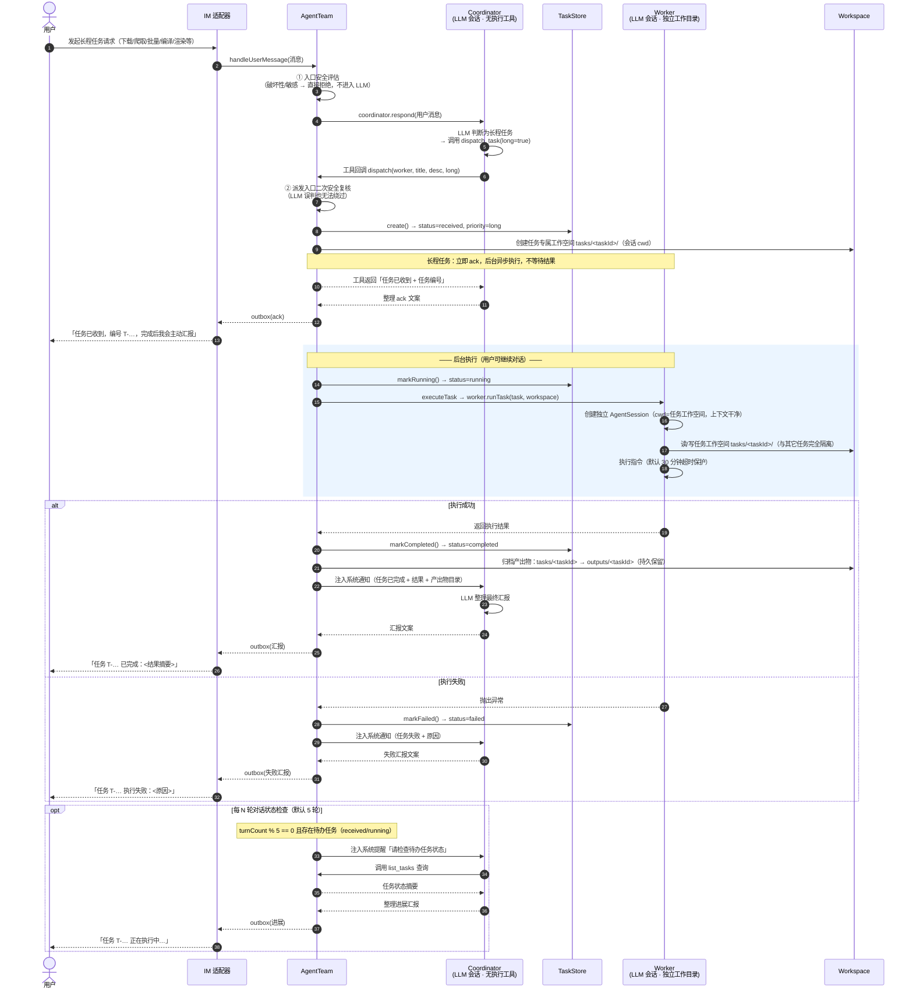
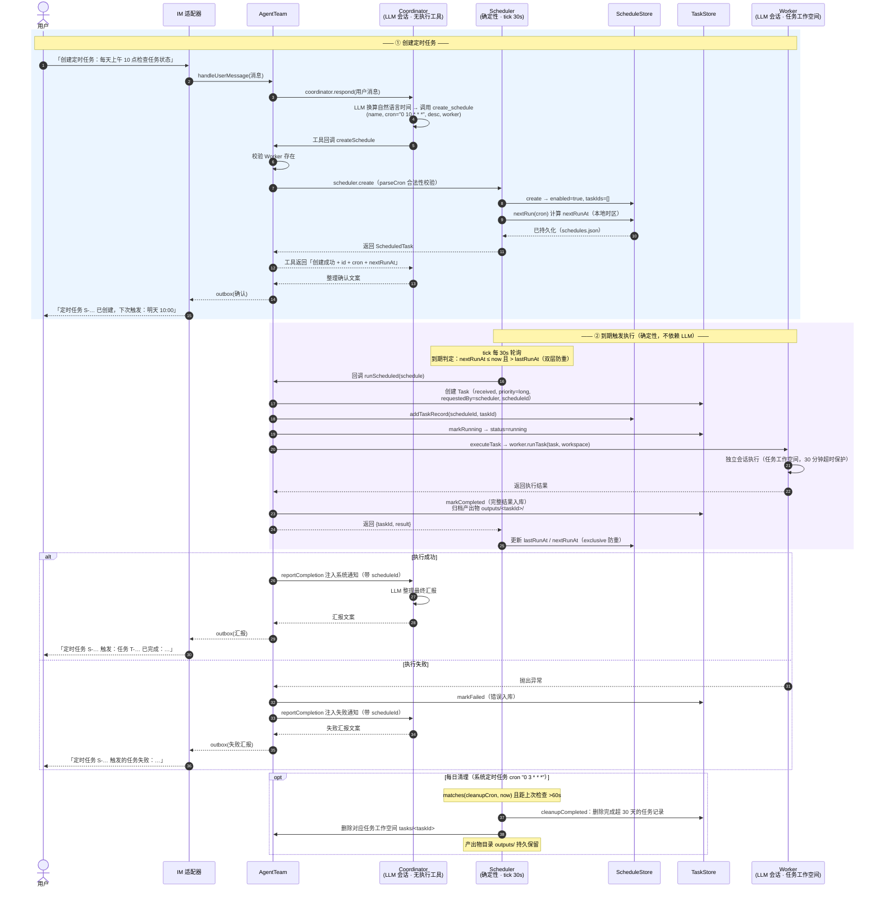

# 架构设计

## 1. 总体架构

Circle 采用「单一入口 + 角色分离」的协作架构。使用者只感知一个 Agent（Coordinator），
系统内部由 Coordinator、Worker、Scheduler 分工协作，通过**确定性代码 + LLM 会话**混合实现：

- **LLM 部分**（需要模型推理的地方）：Coordinator 对话、Worker 任务执行
- **确定性部分**（需要可靠性的地方）：安全评估、任务/定时任务存储、cron 触发、每日清理、IM 路由

```
┌──────────────┐   上行消息     ┌──────────────────────────────┐
│   IM 适配器   │ ────────────► │        AgentTeam             │
│ console/http │               │  ┌────────────────────────┐  │
│ /wechat      │ ◄──────────── │  │  Coordinator (LLM 会话)  │  │
└──────────────┘  下行回复      │  │  自定义工具（TeamGateway）│  │
                               │  └───────────┬────────────┘  │
                               │  dispatch / schedule         │
                               │  ┌───────────▼────────────┐  │
                               │  │ Worker × N (LLM 会话)   │  │
                               │  │  Scheduler (确定性)     │  │
                               │  └───────────┬────────────┘  │
                               │              │               │
                               │  ┌───────────▼────────────┐  │
                               │  │ TaskStore/ScheduleStore │  │
                               │  │ WorkspaceManager/安全   │  │
                               │  └────────────────────────┘  │
                               └──────────────────────────────┘
```

> 各消息流的**时序图**见第 3 节：长程任务完整时序（含后台执行/成功/失败/轮次检查）见 [3.2](#32-长程任务)。

## 2. 角色实现

### 2.1 Coordinator（`src/agents/coordinator.ts`）

- 基于 pi SDK 的 `createAgentSession` 创建**只读会话**：
  - `noTools: "builtin"` —— 不启用任何内置执行工具（read/bash/edit/write 等），
    **从工具层面保证 Coordinator 无法修改/破坏运行环境**；
  - 仅注册 7 个自定义工具，作为与团队交互的唯一通道：

| 工具 | 作用 | 底层 |
| --- | --- | --- |
| `dispatch_task` | 派发执行任务给 Worker | `TeamGateway.dispatch`（含安全复核） |
| `create_schedule` | 创建定时任务 | `Scheduler.create`（cron 校验） |
| `update_schedule` | 修改定时任务 | `Scheduler.update` |
| `delete_schedule` | 删除定时任务 | `Scheduler.delete` |
| `list_tasks` | 查询任务状态 | `TaskStore.summarize` |
| `list_schedules` | 查询定时任务 | `ScheduleStore.summarize` |
| `list_workers` | 查询可用 Worker | Worker 注册表 |

- 系统提示词中固化角色边界与安全规则（拒绝破坏性/敏感请求、长程任务先确认等）；
- **长程任务处理**：`dispatch_task(long=true)` 后工具立即返回
  「任务已收到 + 任务编号」，任务在后台执行；完成时团队注入系统通知，
  Coordinator 整理后主动向用户汇报；
- **每 5 轮对话检查任务状态**：`AgentTeam` 记录对话轮次，每满 5 轮且有
  待办任务时，向 Coordinator 注入状态检查提醒，由其查询并汇报。

### 2.2 Worker（`src/agents/worker.ts`）

- 每个 Worker 一个注册项（名称/职责描述/技能），拥有独立持久目录：
  - 持久目录：`data/workspaces/<workerName>/`，存放技能（`.pi/skills/` 自动发现）与配置；
  - **每个任务拥有独立会话 + 独立工作空间**：会话 `cwd` 指向
    `data/workspaces/<workerName>/tasks/<taskId>/`，任务之间互不可见、互不影响；
  - 任务工作空间内建两个技能**软链接**，技能文件在任务工作空间内即可访问
    （更新实时同步、零拷贝）：`.pi/skills` → Worker 技能目录（项目级）、
    `.pi/agent-skills` → 用户级技能目录（`~/.pi/agent/skills`）；
  - 完成后工作空间归档为产出物目录 `outputs/<taskId>/`（持久保留，便于取用，
    归档时移除技能软链接保持产出纯净），任务工作空间随任务记录 30 天清理；
- 每个任务使用**独立 LLM 会话**（上下文干净）；
- 短程任务：执行后直接返回结果；长程任务：团队先下发 ack，执行完成后再反馈；
- 单任务超时保护（默认 30 分钟，可配置）。

### 2.3 Scheduler（`src/agents/scheduler.ts`）

- **确定性实现**（不依赖 LLM）：tick 轮询（默认 30s）+ 轻量 cron 解析器
  （支持 `*`、数字、范围、步长、列表），保证触发可靠；
- 职责：
  1. 接受 Coordinator 转交的定时任务增删改（cron 合法性校验）；
  2. 到期触发：创建 Task → 派发给指定 Worker → 跟进 → 完成后由
     Coordinator 向用户汇报（通知中带 scheduleId）；
  3. **系统定时任务**：每日 cron（默认 `0 3 * * *`）执行全量任务状态检查，
     清理**已完成超过 30 天**的任务记录及其任务工作空间（`tasks/<taskId>/`），
     产出物目录（`outputs/<taskId>/`）持久保留。

## 3. 消息流

### 3.1 短程任务

```
用户 ─► IM ─► AgentTeam.handleUserMessage
      ├─ 安全评估（通过）
      ├─ Coordinator.respond（LLM 调用 dispatch_task）
      │    └─ TeamGateway.dispatch
      │         ├─ 安全复核 → TaskStore 入库 → Worker 执行（同步等待）
      │         └─ 工具返回值（含结果）
      └─ Coordinator 整理结果 → IM → 用户
```

### 3.2 长程任务

流程概述：`dispatch_task(long=true)` 后工具**立即返回**「任务已收到 + 任务编号」，
任务转入后台异步执行；完成/失败时团队注入系统通知，Coordinator 整理后主动向用户汇报。
用户等待期间可继续对话，系统每 N 轮（默认 5 轮）自动检查一次待办任务进展。



> 说明：`C->>T` 的 `list_tasks` 查询与 `T-->>C` 的状态摘要在实现中均为
> `AgentTeam` 的同步方法调用（非 LLM 回合），此处为便于阅读合并展示；
> 定时任务（见 3.3）触发后同样复用「创建 Task → executeTask → reportCompletion」链路，
> 区别仅在于任务来源为 Scheduler 且汇报文案带 scheduleId。
>
> **汇报截断策略**：注入 Coordinator 的执行结果采用「头尾兼顾」摘要（`summarizeText`）——
> 长文本保留头 1500 + 尾 1500 字符、中间以省略标记连接（关键结论在尾部，保证必达），
> 完整结果始终存于 TaskStore 与产出物目录；系统兜底直发（Coordinator 不可用）截断为 500 字符。

### 3.3 定时任务

流程概述：用户通过 Coordinator 创建定时任务（cron 合法性校验 + 计算 `nextRunAt`）；
Scheduler **确定性 tick 轮询**（默认 30s）扫描到期任务，创建 Task 派发给 Worker，
完成后经 `reportCompletion`（带 scheduleId）由 Coordinator 向用户汇报。
触发全程不依赖 LLM，保证可靠。



**触发防重（双重）**：`nextRun` 支持 `exclusive` 语义（严格晚于触发时刻的下一整分钟起算），
保证 `fire` 后 `nextRunAt` 一定指向未来；tick 判定额外要求 `nextRunAt > lastRunAt`，
即使 `nextRunAt` 因异常落回过去也不会在同一触发点重复 fire。

### 3.4 安全拦截

```
用户请求（破坏性/敏感）
      ├─ 入口安全评估命中 → 直接返回拒绝文案，不经过 LLM、不派发
      └─（若 LLM 误判仍尝试派发）→ dispatch 入口二次安全复核 → 拒绝
```

### 3.5 进程重启（启动对账）

```
进程重启 → AgentTeam.start()
      ├─ TaskStore.reconcileInterrupted：received/dispatched/running 任务
      │    全部标记 failed（原因：进程重启，任务中断）——僵尸不再被 5 轮检查误报、
      │    不再永久滞留（30 天清理只清 completed/failed，标记后进入清理范围）
      └─ 按 requestChatId 分组 → 注入 Coordinator → 向用户发送中断通知
           └─ 仅通知，不自动重跑：重跑由用户决定后重新派发（任务非幂等，避免副作用）
```

> 说明：Coordinator/Worker 会话均为内存会话（`SessionManager.inMemory`），重启后对话上下文
> 丢失；任务/定时任务/产出物均为持久化存储，不受影响。重启时运行中的任务无法断点续跑，
> 只能重跑——因此采用「状态自动对账 + 执行人工确认」策略。

## 4. 关键模块

| 模块 | 文件 | 说明 |
| --- | --- | --- |
| 配置 | `src/config.ts` | 环境变量驱动（见 usage.md） |
| 安全评估 | `src/core/safety.ts` | 破坏性/敏感信息正则规则 + 否定语境处理；确定性、不可绕过 |
| cron | `src/core/cron.ts` | 5 段 cron 解析、nextRun、matches |
| 任务存储 | `src/core/task-store.ts` | JSON 持久化、状态机、30 天清理 |
| 定时任务存储 | `src/core/schedule-store.ts` | JSON 持久化、触发历史 |
| 工作空间 | `src/core/workspace.ts` | Worker 目录/任务工作空间（`tasks/<id>`）/产出物归档（`outputs/<id>`）/过期清理 |
| IM 适配器 | `src/im/*` | 统一接口，console/http/weixin(官方)/wechat(wechaty) 四实现 |
| 团队 | `src/team/agent-team.ts` | 组合三角色、消息路由、轮次状态检查、结果汇报 |

## 5. 数据模型

```
Task: id / title / description / status(received→dispatched→running→completed|failed|rejected)
      / priority(short|long) / workerName / requestedBy(user|scheduler) / scheduleId?
      / requestChatId / createdAt / startedAt / completedAt / result / error

ScheduledTask: id / name / cron(5段) / description / workerName / enabled
               / createdAt / lastRunAt / nextRunAt / taskIds[]
```

## 6. 安全边界（实现层面）

1. **Coordinator 无执行工具**：`noTools: "builtin"`，物理上无法执行命令或改文件；
2. **双重安全评估**：`handleUserMessage` 入口（确定性）+ `dispatch` 派发入口（复核）；
3. **任务工作空间隔离**：每个任务拥有独立会话工作空间（`tasks/<taskId>/`，会话 cwd），
   任务之间互不可见；产出物归档到 `outputs/<taskId>/`，按任务隔离存放，互不覆盖；
4. **敏感信息不落地**：拦截发生在派发之前，Worker 永远不会收到敏感类指令；
5. **超时与清理**：任务超时中止会话；任务工作空间 30 天自动清理（产出物目录保留）防止存储膨胀。
